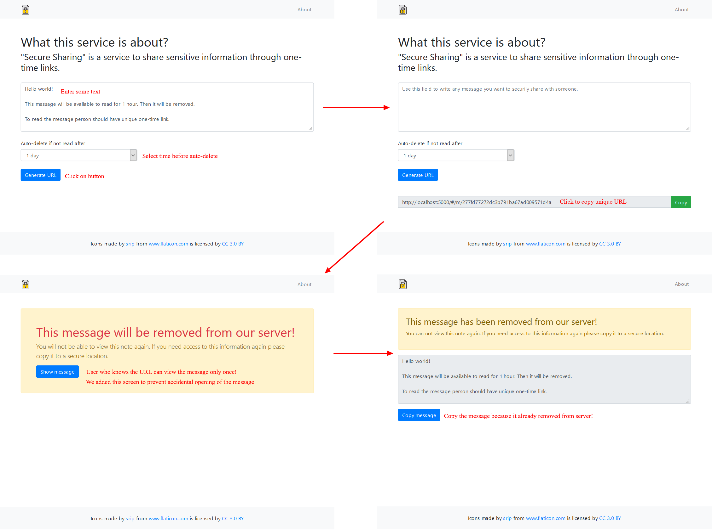

# Secure Sharing

"Secure Sharing" is a service to share sensitive information through one-time links.

App written with Python and JavaScript using the following tools:
* [Flask](https://palletsprojects.com/p/flask/) as web application framework
* [PyCryptodome](https://pycryptodome.readthedocs.io/en/latest/index.html) as cryptographic framework
* [Redis](https://redis.io/) as a storage for messages
* [Bootstrap 4](https://getbootstrap.com/) as a frond-end toolkit

You can test service [here](https://share.ventor.tech).

## Installation

Check [INSTALL.md](INSTALL.md) file.

## Bug Tracker

Bugs are tracked on [GitHub Issues](https://github.com/ventor-tech/secure-sharing/issues).

In case of trouble, please check there if your issue has already been reported.
If you spotted it first, help us smashing it by providing a detailed and welcomed
feedback. Please, do not contact contributors directly about support or help
with technical issues.

## Credits

### Authors

* Alexander Pashuk (alexander@ventor.tech)

### Contributors

### Maintainers

This module is maintained by the [VentorTech](https://ventor.tech).

You are welcome to contribute.
